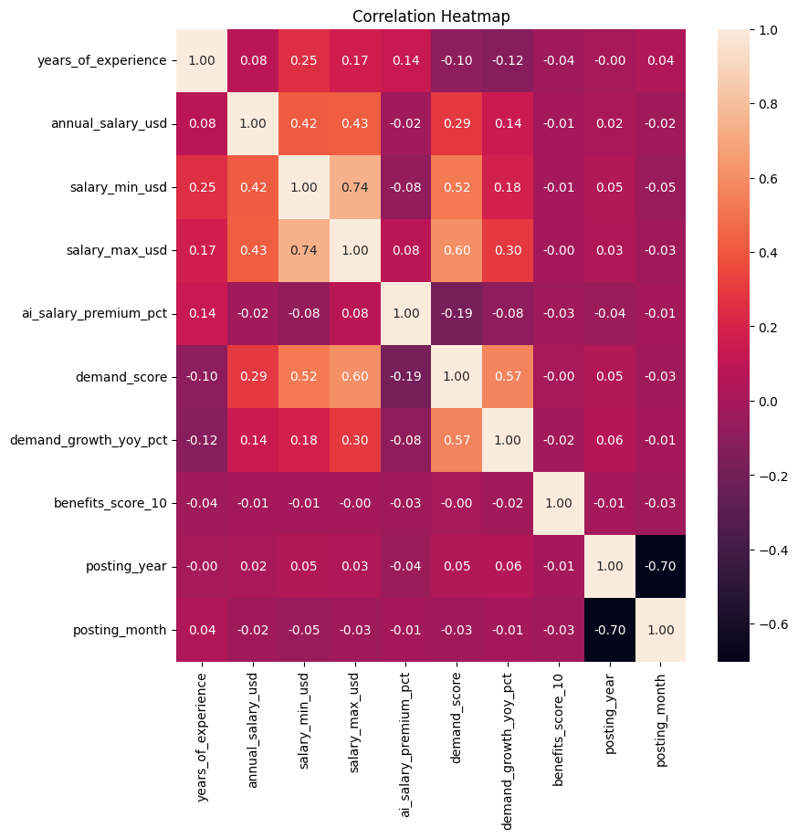
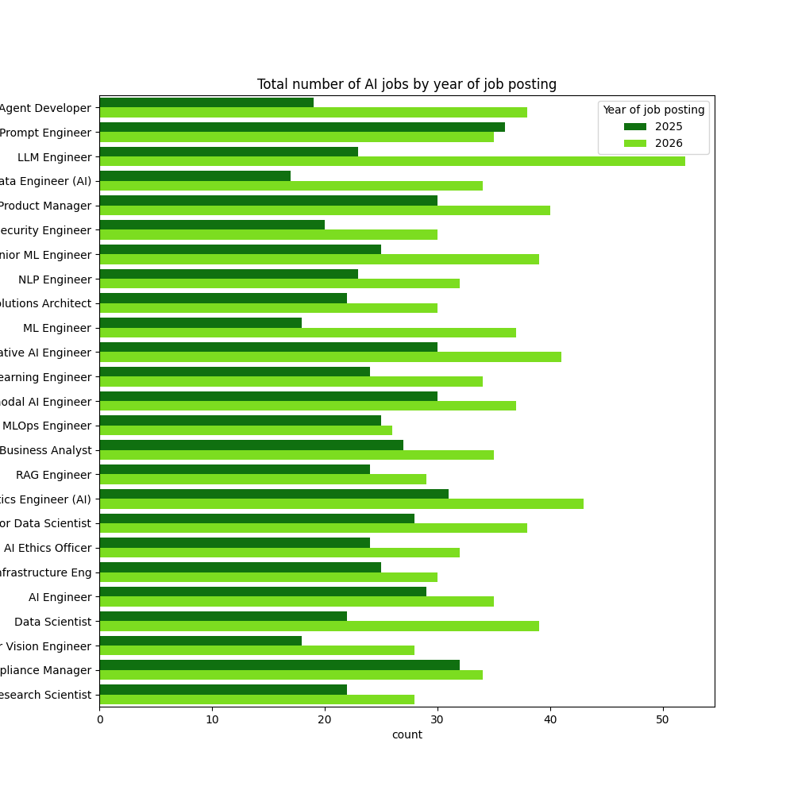
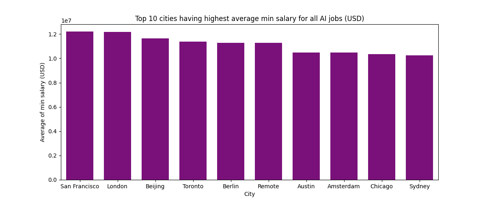
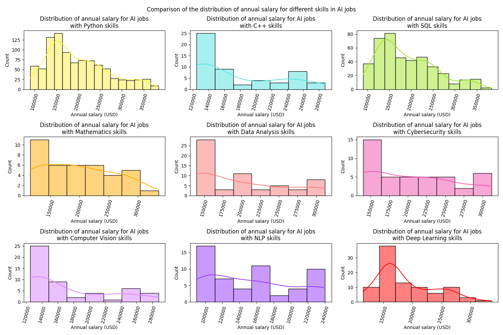
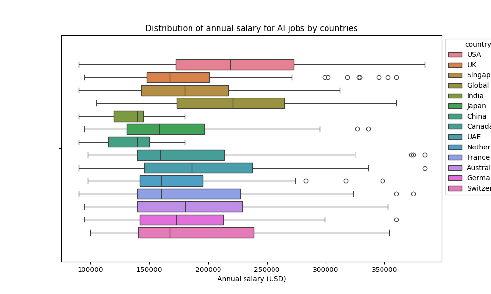

# Data analysis of AI job market and salaries in 2025 and 2026

  
  
  
  
  
  

## Dataset🗂️
- Source: Kaggle 
- Source url: https://www.kaggle.com/datasets/alitaqishah/ai-jobs-market-2025-2026-salaries

## Kaggle Notebook📓
https://www.kaggle.com/code/reshmaharidhas/ai-job-market-analysis-in-2025-and-2026/notebook

## Tech stack💻
- Pandas
- Seaborn
- Matplotlib
- Python
- Numpy

## Visualizations💼

## License💻
MIT
